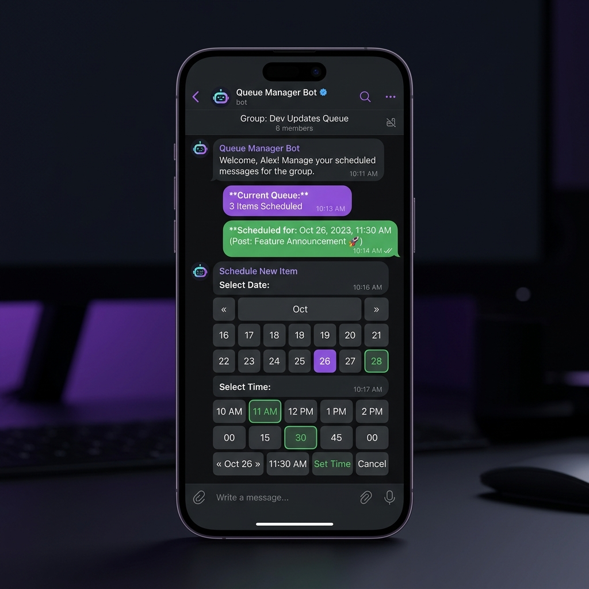

# Telegram Auto-Posting Bot



> [!WARNING]
> **ЛИЦЕНЗИЯ / PROPRIETARY LICENSE:** Данный исходный код защищен авторским правом (Copyright © 2026 knrcharge). Копирование, распространение или коммерческое использование кода **строго запрещено**. Допускается только ознакомительный просмотр.

Асинхронный Телеграм-бот для создания, планирования и автоматической публикации постов в каналы по расписанию. Интегрирован с `APScheduler` для работы с очередями и долговременным планированием.

## 🛠️ Основной стек технологий
- **Фреймворк:** aiogram 3.x
- **Менеджер задач:** APScheduler (с персистентным SQLAlchemy хранилищем задач в SQLite)
- **База данных контента:** aiosqlite (SQLite)
- **FSM (Конечные автоматы):** для пошагового сбора медиа, текста и времени публикации

## 🚀 Основной функционал
- **Поддержка каналов:** Возможность добавлять и администрировать несколько каналов через бота.
- **Типы постов:** Поддерживается планирование обычных текстовых постов, а также постов с изображениями (фото) и видео-материалами.
- **Планирование:** Гибкое указание даты и времени публикации в часовом поясе сервера.
- **Очередь постов:** Просмотр списка всех запланированных отложенных публикаций с возможностью мониторинга.
- **Сохранение при перезагрузке:** Благодаря SQLAlchemyJobStore все активные задачи сохраняются в локальном SQLite-файле `jobs.sqlite`. При перезапуске бота все незавершенные задачи автоматически подгружаются в очередь.

## ⚙️ Установка и настройка

1. Склонируйте репозиторий.
2. Скопируйте `.env.example` в `.env` и укажите данные:
   ```env
   BOT_TOKEN=12345678:AaBbCc...
   ADMIN_IDS=12345678
   ```
3. Установите зависимости:
   ```bash
   pip install -r requirements.txt
   ```
4. Запустите бота:
   ```bash
   python bot.py
   ```

## 📂 Структура проекта
- `bot.py` — Точка входа, регистрация обработчиков, запуск планировщика APScheduler.
- `scheduler.py` — Логика планирования, обертка над задачами APScheduler для отправки контента.
- `database.py` — Инициализация и CRUD-методы для таблиц каналов и постов.
- `keyboards.py` — Генератор интерактивных кнопок (выбор каналов, главное меню).
- `handlers.py` — FSM-сценарии создания публикаций и подключения новых каналов через пересылку сообщений.


---

## 🛡️ Защита исходного кода / Production Obfuscation

Для защиты коммерческих тайн, уникальных алгоритмов и предотвращения несанкционированного изменения кода клиентами в продакшене применяется обфускация. 

В демонстрационных целях в проект добавлена защищенная сборка:
* `obfuscated/` — папка с обфусцированной точкой входа (зашифрованный код, упакованный в безопасный загрузчик).
