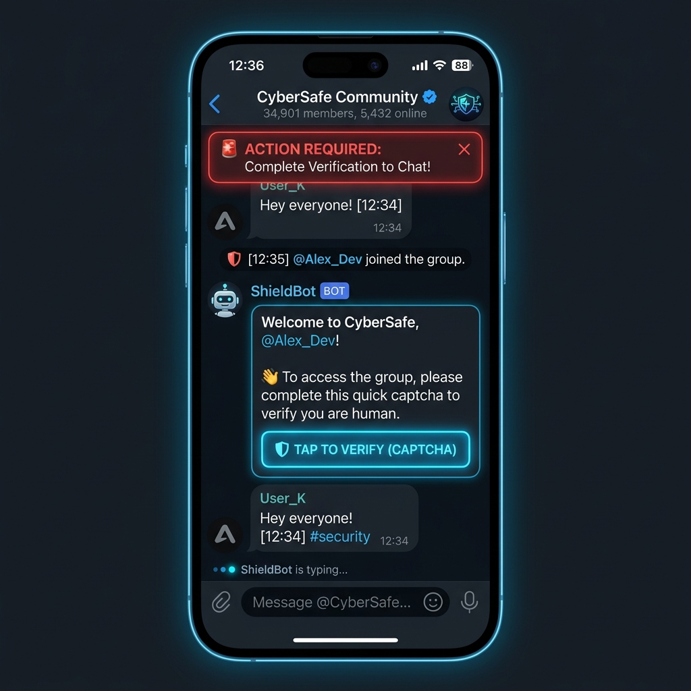

# Telegram Chat Moderation Bot



> [!WARNING]
> **ЛИЦЕНЗИЯ / PROPRIETARY LICENSE:** Данный исходный код защищен авторским правом (Copyright © 2026 knrcharge). Копирование, распространение или коммерческое использование кода **строго запрещено**. Допускается только ознакомительный просмотр.

Профессиональный Телеграм-бот для модерации групп и супергрупп, предотвращения спама, ограничения флуда и верификации новых участников с помощью интерактивной капчи.

## 🛠️ Основной стек технологий
- **Фреймворк:** aiogram 3.x (асинхронное программирование)
- **База данных:** aiosqlite (SQLite для хранения предупреждений/варнов)
- **Матчинг спама:** Регулярные выражения (re) + In-memory таймстемпы для контроля флуда

## 🚀 Основной функционал
- **Защита от спама (Anti-spam):** Автоматическое удаление сообщений, содержащих рекламные реферальные ссылки, упоминания казино, запрещенные ключевые слова.
- **Ограничение флуда (Anti-flood):** Мониторинг частоты отправки сообщений. Если пользователь пишет быстрее установленного лимита (по умолчанию > 5 сообщений за 5 секунд), бот удаляет флуд и выдает временный мут на 5 минут.
- **Интерактивная капча при входе:** При вступлении нового пользователя его права на отправку сообщений автоматически ограничиваются. Бот отправляет сообщение-капчу с кнопкой. Если в течение 60 секунд капча не решена, участник автоматически кикается из чата.
- **Команды модератора:**
  - `/ban` (в ответ на сообщение) — Пожизненная блокировка пользователя в чате.
  - `/mute [время] [причина]` (в ответ на сообщение) — Временное ограничение прав пользователя (например, `/mute 2h спам`).
  - `/warn` (в ответ на сообщение) — Выдача предупреждения. При достижении 3 предупреждений бот автоматически банит пользователя.
  - `/unwarn` (в ответ на сообщение) — Сброс всех предупреждений.

## ⚙️ Установка и запуск

1. Склонируйте репозиторий.
2. Скопируйте `.env.example` в `.env` и укажите токен вашего бота:
   ```env
   BOT_TOKEN=12345678:AaBbCc...
   SPAM_THRESHOLD=5
   ```
3. Установите зависимости:
   ```bash
   pip install -r requirements.txt
   ```
4. Запустите бота:
   ```bash
   python bot.py
   ```

## 📂 Структура проекта
- `bot.py` — Запуск поллинга, инициализация базы и последовательная регистрация роутеров.
- `database.py` — Слой управления предупреждениями пользователей и настройками чатов.
- `filters.py` — Кастомный фильтр для проверки наличия прав администратора у отправителя команды.
- `keyboards.py` — Инлайн-кнопки капчи подтверждения.
- `utils.py` — Функции парсинга текстовых интервалов времени (например, `10m` -> `timedelta`).
- `handlers/` — Обработчики:
  - `moderation.py` — Логика команд банов, мутов, выдачи предупреждений.
  - `antispam.py` — Фильтрация сообщений на ссылки и флуд-активность.
  - `welcome.py` — Капча приветствия и логика автоматического исключения ботов.
