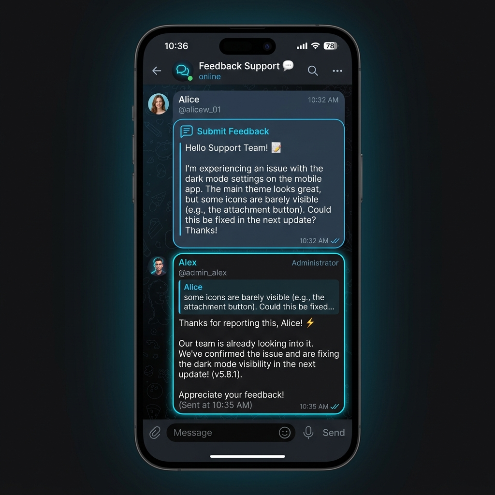

# Telegram Feedback & Support Bot



> [!WARNING]
> **ЛИЦЕНЗИЯ / PROPRIETARY LICENSE:** Данный исходный код защищен авторским правом (Copyright © 2026 knrcharge). Копирование, распространение или коммерческое использование кода **строго запрещено**. Допускается только ознакомительный просмотр.

Асинхронный Telegram-бот обратной связи и поддержки (Feedback Bot), позволяющий организовать удобный прием заявок от пользователей и общение с администратором в формате тикетов на базе асинхронного фреймворка `aiogram 3.x`.

## 🛠️ Основной стек технологий
- **Фреймворк:** aiogram 3.x (Asyncio)
- **База данных:** aiosqlite (SQLite)
- **FSM (Конечные автоматы):** для пошагового сбора обращений и ответов

## 🚀 Основной функционал
- **Подача заявок:** Удобная FSM-форма для отправки вопроса администратору с подтверждением отправки.
- **Два режима ответа для Администратора:**
  1. **Нативный Reply (Быстрый ответ):** Администратор может просто ответить на пересланное ботом сообщение в чате, и бот автоматически перенаправит ответ нужному пользователю.
  2. **Инлайн-кнопки (Интерфейс ответов):** Кнопка «💬 Ответить» под каждым тикетом, запрашивающая текст ответа через FSM-состояние.
- **Управление статусом:** Кнопка «✅ Закрыть» для быстрой очистки интерфейса и пометки тикета как решенного в БД.
- **База обращений:** Полное сохранение истории всех открытых и закрытых обращений.

## ⚙️ Установка и настройка

1. Склонируйте репозиторий.
2. Скопируйте `.env.example` в `.env` и укажите данные:
   ```env
   BOT_TOKEN=your_telegram_bot_token
   ADMIN_ID=12345678
   ```
3. Установите зависимости:
   ```bash
   pip install -r requirements.txt
   ```
4. Запустите бота:
   ```bash
   python bot.py
   ```

## 📂 Структура проекта
- `bot.py` — Инициализация и запуск поллинга.
- `database.py` — Асинхронное создание БД SQLite, добавление пользователей и обработка тикетов.
- `keyboards.py` — Разметка инлайн-клавиатур для пользователя и панели ответа администратора.
- `handlers.py` — Логика приема сообщений от пользователя, нативного перехвата реплаев админа и диалоговые состояния.
- `Dockerfile` — Конфигурация для сборки и развертывания бота на сервере (например, Render.com).

---

## 🛡️ Защита исходного кода / Production Obfuscation

Для защиты коммерческих тайн, уникальных алгоритмов и предотвращения несанкционированного изменения кода клиентами в продакшене применяется обфускация. 

В демонстрационных целях в проект добавлена защищенная сборка:
* `obfuscated/` — папка с обфусцированной точкой входа (зашифрованный код, упакованный в безопасный загрузчик).
